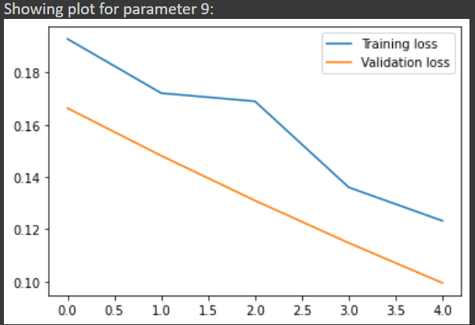
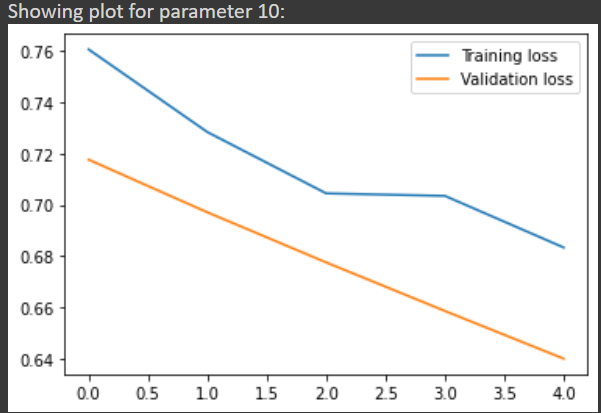

# Multivariate-Time-Series-Forescasting-using-LSTM

Name: Jaskaran Singh Purewal

Roll No.: 101917129

UCS757 Project 1

# Description

Given time series data related to a road which is divided into 101 different subsections. The data is collected by certain Iot devices. Each subsection has 10 rows. We have to use the data of the first 9 years to predict the data for the 10th year for columns 9 to 13 for random 20 subsections.

# Libraries used

pandas, numpy, tensorflow, matplotlib, sklearn, math

# Exploratory Analysis

After analysing the given data, certain abnormalities were detected and dealt with. Abnormalities included:

1. In subsection 92, year 9 Para-1 must be 722 instead of 72 as Para-1 values for a certain subsection was found to remain unchanged in all the subsections. Year 10 data was also missing in subsection 92. Hence, this subsection was removed.

2. In subsection 20 and 26, certain values were missing.

# Preprocessing

Preprocessing included standardization of features using StandardScaler. The scaled data was transformed into a 3d array for model training, with list of subsections with 2d parameter data.

# Model Summary

# Graphs for all parametes of Subsection 80 depicting training and validation loss

# Results

Average RMSE for 20 random Sections: 21.110576137741067
